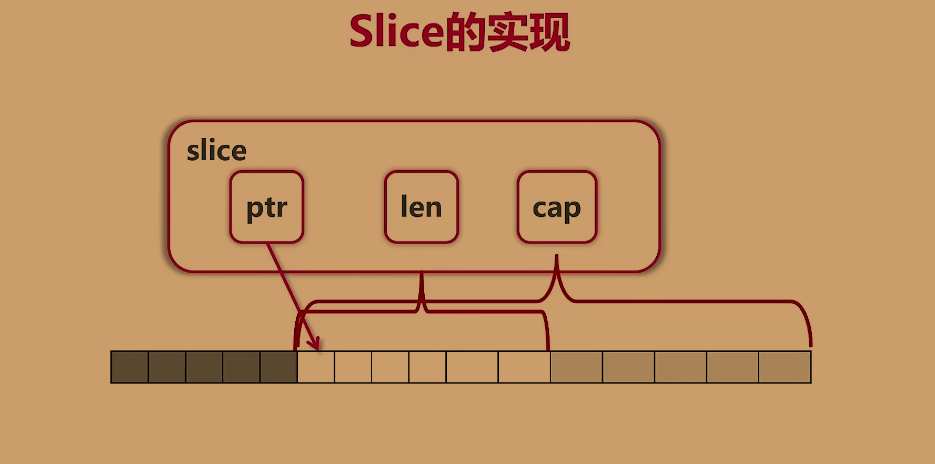

## [[[线索]]](siyuan://blocks/20211118153033-yiyf7mk)

---

1. 如何定义一个切片
    ```go
    arr := [...]int{0, 1, 2, 3, 4, 5, 6, 7}
    slice := arr[2:6]
    ```
2. `arr[2:6]` 是什么意思？
    [2:6] 左开右闭区间（半开半闭区间）， 以 0 为开始索引，从 2 开始 到 6 截止 不包括 6
3. `arr[:6]` 是什么意思？
    以 0 为开始索引，从 0 到 6 截止 不包括 6
4. `arr[2:]` 是什么意思？
    以 0 为开始索引，从 2 到 末尾 截止
5. `arr[:]`
    整个数组
6. slice 的 特点
    本身没有数据，是对底层数组的视图，slice 改变底层数组也改变
    ```go
    arr := [...]int{0, 1, 2, 3, 4, 5, 6, 7}
    slice1 := arr[2:6] // 2,3,4,5
    slice1[0] = 100
    slice2 := arr[:6] // 0,1,2,3,4,5
    slice2[0] = 100
    // slice1:: 100,3,4,5
    // slice2:: 100,1,2,3,4,5
    ```
7. ```go
    arr := [...]int{0, 1, 2, 3, 4, 5, 6, 7}
    s1 := arr[2:6] // 2,3,4,5
    s2 := s1[3:5]  // 5,6 为什么这里却可以获取到 6
    ```

    slice 可以向 后扩展 ，`s1[3:5]` 5 没有超出 `{2,3,4,5,6,7}` cap 的范围 故能取出
8. slice 的 底层实现
    由 ptr len cap 组成
    ptr（指针） 指向 slice 开头的元素
    len 当前 slice 的长度 ， slice[i] 不可以超过 Len(s)
    cap 从 ptr 开始到结束 的 长度, 向后扩展不能超过底层数组 cap(s)

## 总结

---

* 语法
  ```go
  arr := [...]int{0, 1, 2, 3, 4, 5, 6, 7}
  slice1 := arr[2:6] // 2,3,4,5
  slice2 := arr[:6] // 0,1,2,3,4,5
  slice2 := arr[2:] // 2,3,4,5,6,7
  slice2 := arr[:] // 0, 1, 2, 3, 4, 5, 6, 7
  ```

  #注意# 计算机中 一般是 半开半闭区间 包括 2 不包括 6
  * `arr[2:6]` 左开右闭区间（半开半闭区间）， 以 0 为开始索引，从 2 开始 到 6 截止 不包括 6
  * `arr[:6]` 以 0 为开始索引，从 0 到 6 截止 不包括 6
  * `arr[2:]` 以 0 为开始索引，从 2 到 末尾 截止
  * `arr[:]` 整个数组
* 定义
  * slice 本身没有数据 是 对 底层数组 的视图，slice 改变原数组也改变
    ```go
    arr := [...]int{0, 1, 2, 3, 4, 5, 6, 7}
    slice1 := arr[2:6] // 2,3,4,5
    slice1[0] = 100
    slice2 := arr[:6] // 0,1,2,3,4,5
    slice2[0] = 100
    // slice1:: 100,3,4,5
    // slice2:: 100,1,2,3,4,5
    ```
  * slice 可以向后扩展，但是不可以向前扩展
    ```go
    arr := [...]int{0, 1, 2, 3, 4, 5, 6, 7}
    s1 := arr[2:6] // 2,3,4,5
    s2 := s1[3:5]  // 5,6 这里却可以获取到 6
    ```
* 原理
  
  * **ptr**（指针） 指向 slice 开头的元素
  * **len** 当前 slice 的长度 ， `slice[i]` 不可以超过 len(s) **当前切片的长度**
  * **cap** 从 ptr 开始到结束 的 长度, 向后扩展不能超过底层数组 cap(s) **扩展切片的长度**


## [[[反思]]](siyuan://blocks/20211118155447-asr1fu0)

---
