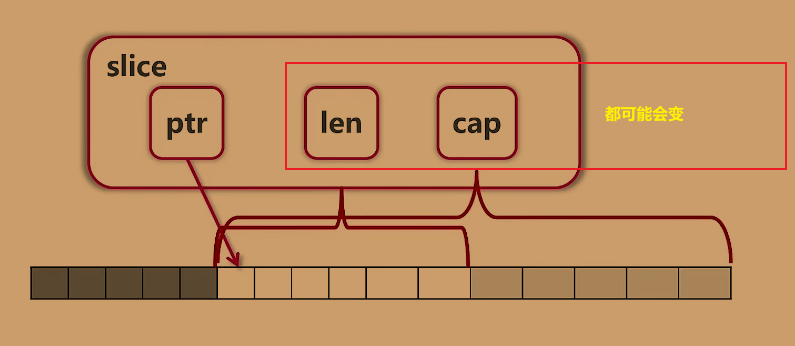

## [[[线索]]](siyuan://blocks/20211118153033-yiyf7mk)

---

1. 如何创建一个 slice？
    ```go
    var slice = []int
    var slice = []int{2,4,6,8}
    var slice = make([]int,12,16)
    ```
2. 请解释以下代码
    ```go
    s1 := []int{2,4,6,8}
    ```

    s1 是一个 对 2,4,6,8 数组的 slice
3. 知道 slice 长度，不知道 各元素的值，如何创建 slice？
    使用 make 函数
    ```go
    make([]int,12,16) 
    // 参数1：slice 的类型
    // 参数2：slice 的 len
    // 参数3：slice 的 cap
    ```
4. slice 的默认值是？
    nil
5. 如果添加的元素超过 cap 的长度 会发生什么？
    原来的数组如果没有使用，会被垃圾回收掉，系统会重新分配一个更长的数组
6. 为什么 使用 append 必须接收返回值？
    由于 append 是 值传递，想要传入的参数发生变化，就必须在外部接收
7. append 有什么副作用？
    会改变 slice 的 len 和 cap，并可能出现新的底层数组
8. 添加元素时 len 与 cap 的关系？
    初始值 都是 0
    len 是当前 slice 的长度，cap 0,1,2, 2^n^ ...
9. 如何复制一个 slice 到另一个 slice？
    使用 copy 函数
    ```go
    copy(slice1,slice2) // 将 slice2 拷贝给 slice1
    ```
10. 如何删除 slice 中的某个元素？
     ```go
     append(slice[:x],slice[x+1:]...)
     ```
11. 如何删除 slice 中开头的元素？
     ```go
     slice = slice[1:]
     ```
12. 如何删除 slice 结尾的元素？
     ```go
     slice = slice[:len(slice)-1]
     ```

## 总结

---

* 创建 slice
  * 只创建不赋值
    ```go
    var s []int
    ```
  * 创建 slice 且赋值（初始化数组）
    ```go
    // s1 是一个 对 2,4,6,8 数组的 slice
    s1 := []int{2,4,6,8}
    ```
  * 知道 slice 的长度，不知道 各元素的值
    ```go
    make([]int,16) // [0 0 0 0 0 0 0 0 0 0 0 0 0 0 0 0] 
    make([]int,10,32) // int 类型 slice len=16 cap=32 // [0 0 0 0 0 0 0 0 0 0]
    ```
* 复制 slice
  * 使用 copy 函数
    ```go
    s1 := []int{2, 4, 6, 8}
    s2 := make([]int, 16)
    copy(s2, s1) // 将 s1 拷贝给 s2
    // s2 [2 4 6 8 0 0 0 0 0 0 0 0 0 0 0 0] 
    // s1 [2 4 6 8]
    ```
* 向 slice 添加元素
  * 通过 append 函数
    ```go
    arr := [...]int{0, 1, 2, 3, 4, 5, 6, 7}
    s2 := append(arr, 10) // 预期 5,6,10
    ```
  * 如果添加的元素 超过 slice 的 cap 
    * 添加的元素的个数超过 cap，系统会重新分配一个更长的数组（原来的数组没使用会被垃圾回收掉）
    * 从数组末尾添加，原数组保持不变（或被回收），slice 会改变，会隐式的创建一个新数组 并指向它
      ```go
      arr := [...]int{0, 1, 2, 3, 4, 5, 6, 7}
      s2 := arr[:]
      s2 = append(s2, 10,10,10,10) 
      fmt.Println(s2, len(s2), cap(s2))// [0 1 2 3 4 5 6 7 10 10 10 10] 12 16
      fmt.Println(arr, len(arr), cap(arr))// [0 1 2 3 4 5 6 7] 8 8
      ```
    * 从数组中间添加，原数组长度不变，超出 len 的 数据会砍掉
      ```go
      arr := [8]int{0, 1, 2, 3, 4, 5, 6, 7}
      s2 := arr[2:5]
      s3 := s2[1:2]
      s3 = append(s3, 10,10,10,10)
      fmt.Println(s2, len(s2), cap(s2)) // [2 3 4] 3 6
      fmt.Println(s3, len(s3), cap(s3)) // [3 10 10 10 10] 5 5
      fmt.Println(arr, len(arr), cap(arr)) // [0 1 2 3 10 10 10 10] 8 8
      ```
  * #注意# append 会导致 slice 的 len 和 cap 都发生改变，有可能产生新的底层数组，所以需要 重新赋值
    
* 删除开头第一个元素
  ```go
  // [2 4 6 8 0 0 0 0 0 0 0 0 0 0 0 0]  删除 8
  s2 := []int{2,4,6,8,0,0,0,0,0,0,0,0,0,0,0,0} // len=16 , cap=16
  front := s2[0] // 获取开头第一个元素
  s2 = s2[1:] // len=15 , cap=16 
  ```
* 删除结尾第一个元素
  ```go
  // [2 4 6 8 0 0 0 0 0 0 0 0 0 0 0 0]  删除 8
  s2 := []int{2,4,6,8,0,0,0,0,0,0,0,0,0,0,0,0} // len=16 , cap=16
  tail := s2[len(s2)-1] // 获取结尾第一个元素
  s2 = s2[:len(s2)-1] // len=15 , cap=16 
  ```
* 添加元素时 len 与 cap 的关系
  * 初始值 都是 0
  * len 是当前 slice 的长度，cap 0,1,2, 2^n^ ...
    ```go
    len=0 , cap=0
    len=1 , cap=1
    len=2 , cap=2
    len=3 , cap=4
    len=4 , cap=4
    len=5 , cap=8
    len=6 , cap=8
    len=7 , cap=8
    len=8 , cap=8
    len=9 , cap=16
    len=10 , cap=16
    len=11 , cap=16
    len=12 , cap=16
    len=13 , cap=16
    len=14 , cap=16
    len=15 , cap=16
    len=16 , cap=16
    len=17 , cap=32
    len=18 , cap=32
    len=19 , cap=32
    len=20 , cap=32
    len=21 , cap=32
    len=22 , cap=32
    len=23 , cap=32
    len=24 , cap=32
    len=25 , cap=32
    len=26 , cap=32
    len=27 , cap=32
    len=28 , cap=32
    len=29 , cap=32
    len=30 , cap=32
    len=31 , cap=32
    len=32 , cap=32
    len=33 , cap=64
    len=34 , cap=64
    len=35 , cap=64
    len=36 , cap=64
    len=37 , cap=64
    len=38 , cap=64
    len=39 , cap=64
    len=40 , cap=64
    len=41 , cap=64
    len=42 , cap=64
    len=43 , cap=64
    len=44 , cap=64
    len=45 , cap=64
    len=46 , cap=64
    len=47 , cap=64
    len=48 , cap=64
    len=49 , cap=64
    len=50 , cap=64
    len=51 , cap=64
    len=52 , cap=64
    len=53 , cap=64
    len=54 , cap=64
    len=55 , cap=64
    len=56 , cap=64
    len=57 , cap=64
    len=58 , cap=64
    len=59 , cap=64
    len=60 , cap=64
    len=61 , cap=64
    len=62 , cap=64
    len=63 , cap=64
    len=64 , cap=64
    len=65 , cap=128
    len=66 , cap=128
    len=67 , cap=128
    len=68 , cap=128
    len=69 , cap=128
    len=70 , cap=128
    len=71 , cap=128
    len=72 , cap=128
    len=73 , cap=128
    len=74 , cap=128
    len=75 , cap=128
    len=76 , cap=128
    len=77 , cap=128
    len=78 , cap=128
    len=79 , cap=128
    len=80 , cap=128
    len=81 , cap=128
    len=82 , cap=128
    len=83 , cap=128
    len=84 , cap=128
    len=85 , cap=128
    len=86 , cap=128
    len=87 , cap=128
    len=88 , cap=128
    len=89 , cap=128
    len=90 , cap=128
    len=91 , cap=128
    len=92 , cap=128
    len=93 , cap=128
    len=94 , cap=128
    len=95 , cap=128
    len=96 , cap=128
    len=97 , cap=128
    len=98 , cap=128
    len=99 , cap=128
    ```
* slice 的 默认值（zero value）为 nil

## [[[反思]]](siyuan://blocks/20211118155447-asr1fu0)

---

* go 各类型的 zero value 默认值都是什么？
* arr 的 最终结果为什么是 [0 1 2 3 4 5 6 10] ？7 去哪了？
  ```go
  arr := [...]int{0, 1, 2, 3, 4, 5, 6, 7}
  s1 := arr[2:6] // 2,3,4,5
  s2 := s1[3:5]  // 5,6
  s3 := append(s2, 10) // 预期 5,6,10
  s4 := append(s3, 11) // 预期 5,6,10,11
  s5 := append(s4, 12)// 预期 5,6,10,11,12
  fmt.Println("s3 , s4 , s5 = ", s3, s4, s5) // s3 , s4 , s5 =  [5 6 10] [5 6 10 11] [5 6 10 11 12]
  fmt.Println("arr = ", arr) // arr =  [0 1 2 3 4 5 6 10]
  ```

  猜测：
  s2 为 {5,6} ，s3 切片创建时 向 s2 末尾 插入 10 ，导致原本 {0, 1, 2, 3, 4, 5, 6, 7} 变成 {0, 1, 2, 3, 4, 5, 6, 10 , 7} 
  又因为 go 的数组在创建完成后 len 是固定的（猜测），所以 7 会被砍掉，以保持 len 不变
