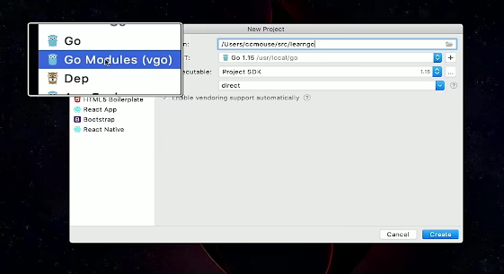
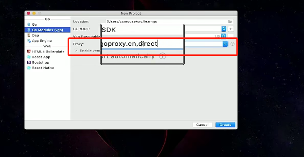
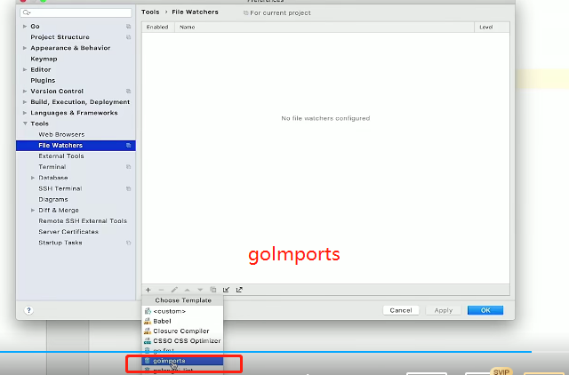
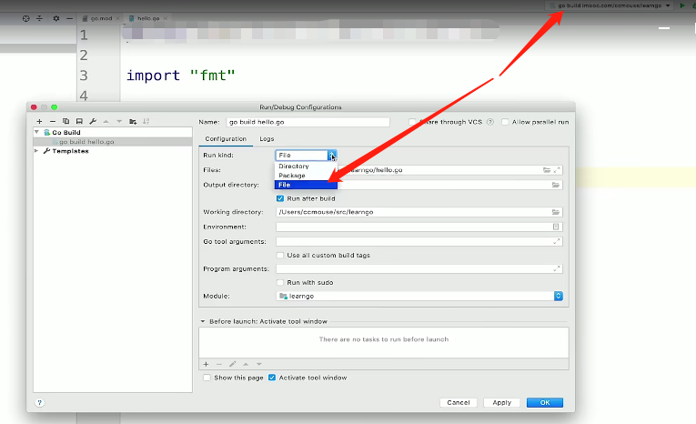

## 线索

---

1. 创建一个 go 项目
2. go mod 配置
3. File watcher goImports 配置 （保存时代码格式化）
4. 如何防止 main 函数冲突

## 总结

---

* 重要内容总结
  1. 创建 go 项目 选择 go modules
      
      * 设置 go 模块代理
        > 💡 相当于 npm 配置 淘宝镜像
        >

        
  2. go mod 配置
      go.mod 文件
      ```go
      module "learngo" // moudle "github.com/hhy/learngo" 两种形式推荐第二种
      ```
  3. File watcher goImports 配置 （保存时代码格式化）
      
  4. 运行方式配置 （运行包改为运行这个文件，防止 main 函数冲突，测试用）
      
