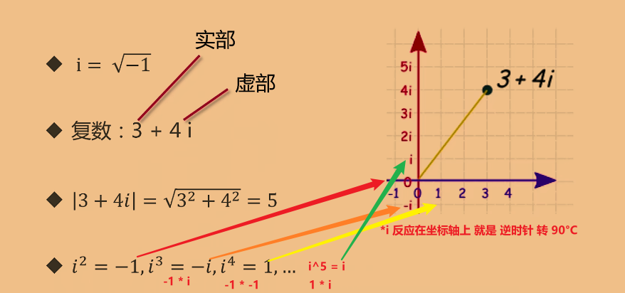
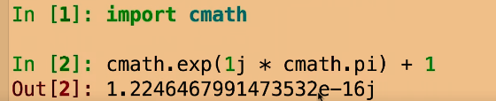

## [[[线索]]](siyuan://blocks/20211118153033-yiyf7mk)

---

1. go 语言都有哪些类型？数值型的分类？
2. 什么是不规定长度的整数类型
3. go 语言如何定义类似 long 的 长整数类型？
4. byte 与 rune 的异同
5. 复数是什么？go 的复数 有什么特点？
6. go 的类型转换有什么特点？

## 总结

---

1. go 语言都有哪些类型？数值型的分类？
    * 布尔类型（bool）
    * 数值类型
      * 整型
        * int8 int16 int32 int64 int
        * uint8 uint16 uint32 uint64 uint
      * 字符型
        * byte 
          * 8 位
          * 等价于 int8
          * 可以与 整型 混用
        * rune
          * 32 位
          * 等价于 int32
          * 可以与 整型 混用
          * 用于解决国际化 char 1 字节带来了很多问题（1 个汉字占 2 个字节）
      * 浮点型
        * float32 float64 （符合 IEEE-754 标准）
        * complex64 complex128
    * 字符串类型（string）
2. 什么是不规定长度的整数类型？
    * 长度根据操作系统来（64 位操作系统就是 64 位的，32 位操作系统就是 32 位的）
3. go 语言如何定义类似 long 的 长整数类型？
    * 没有 long 类型 ，长类型直接 定义 int64
4. byte 与 rune 的异同
    * 同为 数值型的 字符型，可以与整型混用
      ```go
      var c int = 1
      var d byte = 'a'
      fmt.Println(d + c) // 报错:: invalid operation: d + c (mismatched types byte and int)
      fmt.Println(d+1) // 98
      ```
    * |  | byte         | rune                                                                        |
      | -- | -------------- | ----------------------------------------------------------------------------- |
      |  | 8 位         | 32 位                                                                       |
      |  | 等价于 uint8 | 等价于 int32                                                                |
      |  |              | 用于解决 国际化场景下 char 1 字节不够用的 问题 （中文 一个汉字占 2 字节）<br /> |
5. 什么是复数？go 的复数 有什么特点？
    * 复数
      
    * go 实现 欧拉公式
       (0+1.2246467991473515e-16i)
      ```go
      package main

      import (
      	"fmt"
      	"math"
      	"math/cmplx"
      )

      func testEuler() {
      	c := 3 + 4i // i = 根号-1  4i = -1的平方 * -1的平方 = 1 所以 c = 5
      	fmt.Println("testEuler:: ", cmplx.Abs(c))
      }

      func euler() {
      	//	底数是 math.E
      	//	指数 1i * math.Pi , 1i 是因为 单独 i 会被认为是变量
      	fmt.Println(
      		cmplx.Exp(1i*math.Pi)+1,
      		cmplx.Pow(math.E, 1i*math.Pi)+1,
      	)
      	// (0+1.2246467991473515e-16i)
      	//	因为 complex 的 实部虚部 都是浮点数 所以结果 会是一个 浮点数

      	fmt.Printf(
      		"%.3f\n",
      		cmplx.Exp(1i*math.Pi)+1,
      	)
      	// (0.000+0.000i)
      }

      func main() {
      	testEuler()
      	euler()
      }

      ```
    * python 实现欧拉公式
      
6. go 的类型转换有什么特点？
    * 没有隐式类型转换，只有强制（显示）类型转换
      ```go
      package main

      import (
      	"fmt"
      	"math"
      )

      func triangle() {
      	var a, b int = 3, 4
      	var c int
      	var d byte = 'a'
      	var e float64 = 123123.5
              // math.Sqrt 的 入参 返回值 都是 float64 , 所以需要强制转换为 float64
      	c = int(math.Sqrt(float64(a*a + b*b))) 
      	fmt.Println(a,b,c,d,rune(e)) // 123123
      }
      func main() {
      	triangle()
      }
      ```

浮点数在任何语言中都存在精度不准的情况

## [[[反思]]](siyuan://blocks/20211118155447-asr1fu0)

---

* 没涉及到的？
  * 没讲 各种类型所占的 字节数
  * 没讲 字符型 与 UTF-8 ASCLL unicode 编码的关系
